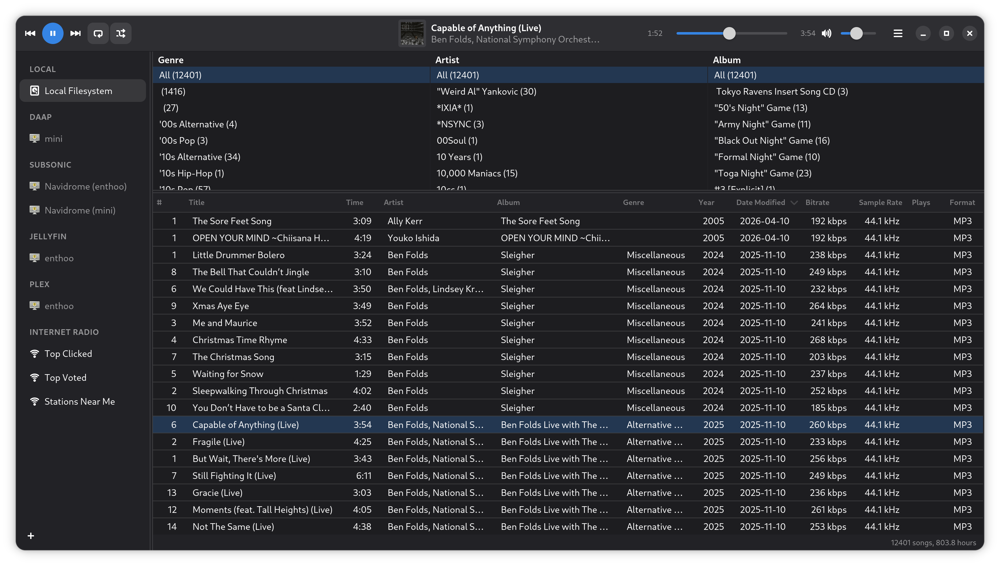

# Tributary

[](LICENSE)
[](https://github.com/jm2/tributary/actions)

A high-performance, **Rhythmbox-style** media manager written in pure Rust with **GTK4** and **libadwaita**.

Tributary provides a unified interface for managing and streaming music from multiple sources — local files, Subsonic/Navidrome, Jellyfin, Plex, DAAP/iTunes shares, and internet radio — all through a single, responsive library view.



## Features

| Feature | Status |
|---------|--------|
| GTK4 / libadwaita UI (Rhythmbox-style `GtkColumnView`) | ✅ |
| Browser filtering (Genre → Artist → Album) | ✅ |
| Local library with FS `date_modified` scanning | ✅ |
| Real-time filesystem watching (`notify`) | ✅ |
| SQLite persistence (`SeaORM`) | ✅ |
| GStreamer audio playback (`playbin3`) | ✅ |
| MPRIS / SMTC / macOS Now Playing integration (`souvlaki`) | ✅ |
| Playback controls (play/pause, next/prev, seek, volume) | ✅ |
| Shuffle & repeat (off / all / one) with persistence | ✅ |
| Column sort persistence | ✅ |
| Subsonic / Navidrome / Nextcloud Music backend | ✅ |
| Jellyfin backend | ✅ |
| Plex backend | ✅ |
| DAAP / iTunes Sharing backend (DMAP binary protocol) | ✅ |
| mDNS zero-config discovery (Subsonic, Plex, DAAP) | ✅ |
| Jellyfin UDP broadcast discovery | ✅ |
| DAAP sidebar eject button (disconnect) | ✅ |
| Password-only auth dialog (DAAP) | ✅ |
| Regular discovery refresh (add/remove servers dynamically) | ✅ |
| Manual server addition/deletion with `servers.json` persistence | ✅ |
| Internet Radio (Top Clicked, Top Voted, Stations Near Me) | ✅ |
| Tiered geo-location (geo-distance → state → country) | ✅ |
| Column drag-and-drop reordering with persistence | ✅ |
| Regular & smart playlists (iTunes-style rules engine) | ✅ |
| Realtime text search filter (title, artist, album, genre) | ✅ |
| Song metadata editing (Properties dialog with Save/Cancel) | ✅ |
| Batch metadata editing (multi-select) | ✅ |
| MusicBrainz auto-fill lookup | ✅ |
| Keyboard shortcut: `Ctrl+F` / `Cmd+F` to search | ✅ |
| XDG music directory support (non-English locales) | ✅ |
| Network connection guard (prevents duplicate auth) | ✅ |
| i18n/l10n framework (13 languages, auto locale detection) | ✅ |
| Audio output selector (local + MPD, iTunes AirPlay-style) | ✅ |
| MPD output backend (sink-only, TCP with security hardening) | ✅ |
| Output switching (click to swap local ↔ MPD) | ✅ |
| AirPlay 1 (RAOP) output | ✅ Requires a working `raopsink` GStreamer element or `shairport-sync` on `PATH`; falls back automatically |
| AirPlay 2 / HomeKit output | ❌ Not yet supported — see [AirPlay 2 roadmap](#airplay-2-roadmap) below |
| Chromecast output (Cast V2 — local files + remote sources) | ✅ |
| Album artist sort (preference toggle) | ✅ |
| Smart playlist compound sort (multi-key ordering) | ✅ |
| Geo-distance sorting for Stations Near Me | ✅ |
| USB device browsing (sidebar + tracklist scan) | ✅ |
| USB file transfer (copy to device with progress) | ✅ |
| Multiple music library directories | ✅ |
| Playlist import/export (XSPF) | ✅ |
| Default smart playlists (Recently Added, Recently Played, Top 25) | ✅ |
| Window position persistence | ✅ |
| Windows 11 Snap Layout support | ✅ |
| macOS "Open With" file association | ✅ |
| Cross-platform: Linux, macOS, Windows | ✅ |
| Light & dark mode | ✅ Automatic (libadwaita) |

## Architecture

```
┌─────────────────────────────────────────────────────┐
│                   GTK4 / libadwaita UI              │
│     (GtkColumnView, Browser, Sidebar, HeaderBar)    │
├─────────────────────────────────────────────────────┤
│              MediaBackend trait (async)             │
├──────────┬──────────┬───────────┬──────┬────────────┤
│  Local   │ Subsonic │  Jellyfin │ Plex │    DAAP    │
│ (SQLite) │ (REST)   │  (REST)   │(REST)│(DMAP/mDNS) │
├──────────┴──────────┴───────────┴──────┴────────────┤
│           GStreamer (audio pipeline)                │
├─────────────────────────────────────────────────────┤
│    Platform: MPRIS │ SMTC │ MPNowPlayingInfoCenter  │
└─────────────────────────────────────────────────────┘
```

All backends implement a single `MediaBackend` async trait, so the UI layer never knows or cares where the music comes from.

---

## Installation

### Fedora (COPR)

Tributary is available from the [jmsqrd/tributary](https://copr.fedorainfracloud.org/coprs/jmsqrd/tributary/) COPR repository:

```bash
sudo dnf copr enable jmsqrd/tributary
sudo dnf install tributary
```

### Arch Linux (AUR)

Tributary is available on the [AUR](https://aur.archlinux.org/) in three variants:

| Package | Description |
|---------|-------------|
| [`tributary`](https://aur.archlinux.org/packages/tributary) | Build from the latest release source |
| [`tributary-bin`](https://aur.archlinux.org/packages/tributary-bin) | Pre-built binary from the latest release |
| [`tributary-git`](https://aur.archlinux.org/packages/tributary-git) | Build from the latest `main` branch commit |

Install with your preferred AUR helper, for example:

```bash
yay -S tributary-bin
```

### Windows (winget)

Tributary is available via [winget](https://learn.microsoft.com/en-us/windows/package-manager/winget/):

```powershell
winget install jm2.Tributary
```

### Other Platforms

Pre-built packages for Linux (Flatpak, .deb, .rpm), macOS (.dmg), and Windows (.exe installer, .zip) are also available on the [Releases](https://github.com/jm2/tributary/releases) page.

> **macOS note:** The macOS `.dmg` is ad-hoc signed but not notarized, so macOS Gatekeeper will block it on first launch. After mounting the DMG and dragging Tributary to Applications, run:
> ```bash
> xattr -cr /Applications/Tributary.app
> ```
> Then open normally. This is only needed once.

---

## Building from Source

### Prerequisites (all platforms)

- [Rust 1.80+](https://rustup.rs) (stable toolchain)
- `pkg-config`

### Linux

**Debian / Ubuntu:**
```bash
sudo apt install libgtk-4-dev libadwaita-1-dev libgstreamer1.0-dev libdbus-1-dev pkg-config build-essential
```

**Fedora:**
```bash
sudo dnf install gtk4-devel libadwaita-devel gstreamer1-devel dbus-devel pkgconf-pkg-config gcc
```

**Arch Linux:**
```bash
sudo pacman -S gtk4 libadwaita gstreamer dbus pkgconf base-devel
```

Then build:
```bash
cargo build --release
# or use the helper script:
./scripts/build-linux.sh
```

The binary is at `target/release/tributary`.

### macOS

Requires [Homebrew](https://brew.sh):

```bash
brew install gtk4 libadwaita pkg-config gstreamer gst-plugins-good gst-plugins-bad gst-plugins-ugly gst-libav adwaita-icon-theme
cargo build --release
```

To create a `.app` bundle and `.dmg`:
```bash
brew install create-dmg   # optional, for DMG packaging
./scripts/build-macos.sh --dmg
```

The app bundle is at `dist/Tributary.app`, and the DMG at `dist/Tributary.dmg`.

> **Note:** The `.app` bundle includes rpath-fixed dylibs and is ad-hoc code-signed so it can run without Homebrew on the target machine. For distribution, proper Apple Developer code signing and notarization are recommended.

### Windows

Requires [MSYS2](https://www.msys2.org) with the CLANG64 environment:

```powershell
# In an MSYS2 CLANG64 shell:
pacman -S mingw-w64-clang-x86_64-gtk4 \
          mingw-w64-clang-x86_64-libadwaita \
          mingw-w64-clang-x86_64-gstreamer \
          mingw-w64-clang-x86_64-gst-plugins-good \
          mingw-w64-clang-x86_64-gst-plugins-bad \
          mingw-w64-clang-x86_64-gst-libav \
          mingw-w64-clang-x86_64-pkg-config \
          mingw-w64-clang-x86_64-toolchain
```

Then, in PowerShell:
```powershell
# Ensure Rust's LLVM target is installed:
rustup target add x86_64-pc-windows-gnullvm

# Build and bundle DLLs:
.\scripts\build-windows.ps1
```

This produces `dist/tributary-windows.zip` with the executable and all required DLLs/resources.

### Flatpak (Linux)

```bash
# Install flatpak-builder if needed:
sudo apt install flatpak-builder

# Build and install locally:
flatpak-builder --force-clean --repo=repo --install --user \
  build-dir build-aux/flatpak/io.github.tributary.Tributary.yml
```

---

## Running

```bash
# From a release build:
./target/release/tributary

# With debug logging:
RUST_LOG=tributary=debug ./target/release/tributary

# With trace-level logging:
RUST_LOG=tributary=trace ./target/release/tributary
```


---

## Development

### Git Hooks

Tributary includes a pre-commit hook that runs `cargo fmt --check` to prevent formatting errors from being committed. To enable it after cloning:

```bash
git config core.hooksPath hooks
```

### Developer Build Scripts

All three platform build scripts support quick-exit modes for formatting, type-checking, and linting:

```bash
# Linux / macOS:
./scripts/build-linux.sh --fmt       # or build-macos.sh --fmt
./scripts/build-linux.sh --check     # or build-macos.sh --check
./scripts/build-linux.sh --clippy    # or build-macos.sh --clippy
```

```powershell
# Windows (PowerShell):
.\scripts\build-windows.ps1 -Fmt
.\scripts\build-windows.ps1 -Check
.\scripts\build-windows.ps1 -Clippy
.\scripts\build-windows.ps1 -Test
.\scripts\build-windows.ps1 -Run
```

Clippy runs with `clippy::pedantic` and `clippy::nursery` enabled crate-wide (configured in `src/main.rs`).

### Testing & Code Quality

```bash
# Run all tests (unit + proptest property-based):
cargo test

# Quick coverage summary (requires cargo-llvm-cov):
cargo llvm-cov --summary-only

# Full HTML coverage report:
cargo llvm-cov --html --output-dir coverage
```

CI automatically runs on every push/PR:
- **Security audit** — `cargo audit` checks dependencies against the RustSec Advisory Database
- **Pedantic Clippy** — `clippy::pedantic` + `clippy::nursery` with `-D warnings`
- **Code coverage** — `cargo-llvm-cov` HTML report uploaded as a CI artifact (Linux x86_64)
- **Weekly fuzzing** — `cargo-fuzz` target for the DMAP binary parser (5 min, Sundays)

---

## Project Structure

```
src/
├── main.rs                 # Application entry point (GTK + tokio bootstrap)
├── discovery.rs            # mDNS + UDP zero-config server discovery
├── architecture/
│   ├── mod.rs              # Module root & re-exports
│   ├── models.rs           # Track, Album, Artist, SearchResults, LibraryStats
│   ├── backend.rs          # MediaBackend async trait
│   └── error.rs            # BackendError (thiserror)
├── audio/
│   ├── mod.rs              # GStreamer Player (playbin3, bus watch, position timer)
│   ├── output.rs           # AudioOutput trait abstraction
│   ├── local_output.rs     # Local GStreamer playback (AudioOutput impl)
│   ├── mpd_output.rs       # MPD TCP output (AudioOutput impl)
│   ├── airplay_output.rs   # AirPlay/RAOP output (scaffolding)
│   ├── chromecast_output.rs# Chromecast/Cast V2 output (local + remote)
│   └── cast_http_server.rs # Embedded LAN-only HTTP server for Chromecast
├── db/
│   ├── mod.rs              # Database layer root
│   ├── connection.rs       # SQLite init, XDG paths, migration runner
│   ├── entities/
│   │   └── track.rs        # SeaORM entity for tracks table
│   └── migration/
│       └── m20250101_000001_create_tables.rs
├── desktop_integration/
│   └── mod.rs              # OS media controls via souvlaki (MPRIS/SMTC/Now Playing)
├── local/
│   ├── mod.rs              # Local backend root
│   ├── backend.rs          # MediaBackend impl (LocalBackend)
│   ├── engine.rs           # Async scan + notify FS watcher + LibraryEvent channel
│   ├── tag_parser.rs       # lofty audio tag extraction
│   ├── tag_writer.rs       # lofty audio tag writing (MP3, M4A, OGG, FLAC)
│   ├── playlist_manager.rs # Regular + smart playlist CRUD
│   ├── playlist_io.rs      # XSPF playlist import/export with fingerprint matching
│   └── smart_rules.rs      # iTunes-style smart playlist rules engine
├── subsonic/
│   ├── mod.rs              # Subsonic backend root
│   ├── api.rs              # JSON response types (Subsonic REST API)
│   ├── client.rs           # HTTP client (token + legacy auth, request building)
│   └── backend.rs          # MediaBackend impl (in-memory cache)
├── jellyfin/
│   ├── mod.rs              # Jellyfin backend root
│   ├── api.rs              # JSON response types (Jellyfin REST API)
│   ├── client.rs           # HTTP client (API key auth, username/password auth)
│   └── backend.rs          # MediaBackend impl (in-memory cache)
├── plex/
│   ├── mod.rs              # Plex backend root
│   ├── api.rs              # JSON response types (Plex REST API)
│   ├── client.rs           # HTTP client (X-Plex-Token, plex.tv sign-in)
│   └── backend.rs          # MediaBackend impl (in-memory cache)
├── daap/
│   ├── mod.rs              # DAAP backend root
│   ├── dmap.rs             # DMAP binary TLV parser (nom-based, 24 tag types)
│   ├── client.rs           # HTTP client (5-step session handshake)
│   └── backend.rs          # MediaBackend impl (in-memory cache)
├── device/
│   ├── mod.rs              # Device trait + DeviceInfo (portable device abstraction)
│   ├── usb.rs              # USB mass storage detection (Linux, macOS, Windows)
│   └── transfer.rs         # Async file copy to USB devices with progress
├── radio/
│   ├── mod.rs              # Internet Radio module root
│   ├── api.rs              # RadioStation + GeoLocation serde types
│   ├── client.rs           # Radio-Browser API client (DNS mirror, geolocation)
│   └── geo.rs              # Haversine distance + US state/country centroid tables
└── ui/
    ├── mod.rs              # UI module root
    ├── window.rs           # Main window orchestration (GTK lifecycle + event wiring)
    ├── window_state.rs     # Shared WindowState struct (Rc/RefCell state bundle)
    ├── source_connect.rs   # Sidebar selection handler (source switching + auth flows)
    ├── discovery_handler.rs# mDNS/DNS-SD event handler (sidebar + output list)
    ├── context_menu.rs     # Tracklist right-click menu (playlist ops + properties)
    ├── playlist_actions.rs # Playlist CRUD (create, rename, delete, reorder)
    ├── output_switch.rs    # Output selector click handler (local/MPD/AirPlay/Cast)
    ├── header_bar.rs       # Playback controls, now-playing, progress, volume
    ├── sidebar.rs          # Source list (local + remote + discovered + eject)
    ├── browser.rs          # Search bar + Genre → Artist → Album filter panes
    ├── tracklist.rs        # GtkColumnView track listing
    ├── properties_dialog.rs# Song properties editor (single + batch + MusicBrainz)
    ├── playlist_editor.rs  # Smart playlist rules editor dialog
    ├── preferences.rs      # Preferences dialog (library path, browser, columns)
    ├── output_dialogs.rs   # Add Output dialog + outputs.json persistence
    ├── server_dialogs.rs   # Add/auth server dialogs + servers.json persistence
    ├── album_art.rs        # Album art extraction (embedded tags + remote fetch)
    ├── playback.rs         # Playback context + track advance logic
    ├── persistence.rs      # Settings persistence (sort, shuffle, repeat, CSS)
    ├── radio.rs            # Radio-specific UI helpers (column switching, geo-sort)
    ├── dummy_data.rs       # Default sidebar source entries
    ├── style.css           # Custom CSS overrides
    └── objects/
        ├── mod.rs          # GObject wrappers root
        ├── track_object.rs # GObject wrapper for track rows
        ├── source_object.rs# GObject wrapper for sidebar sources
        └── browser_item.rs # GObject wrapper for browser filter items

scripts/
├── build-linux.sh          # Linux build + packaging helper
├── build-macos.sh          # macOS .app/.dmg builder (rpath fix + code sign)
└── build-windows.ps1       # Windows DLL bundler + Inno Setup

build-aux/
├── arch/PKGBUILD           # Arch Linux package definition
├── flatpak/                # Flatpak manifest
└── inno/tributary.iss      # Windows Inno Setup installer script

data/                        # .desktop, AppStream metainfo, icons
```

---

## Usage

### Browsing Your Library

On first launch, Tributary scans your `~/Music` folder (configurable in Preferences) and displays all discovered tracks in the main tracklist. Use the **browser panes** above the tracklist to filter by Genre → Artist → Album. Click any column header to sort; click again to reverse; click a third time to clear the sort.

### Connecting to Remote Servers

Remote servers are discovered automatically via mDNS (DAAP, Subsonic, Plex) and UDP broadcast (Jellyfin). Discovered servers appear in the sidebar — click one to connect. Password-protected DAAP shares show a lock icon; passwordless shares connect with a single click.

To manually add a server, click the **+** button in the sidebar toolbar and enter the server type (Subsonic, Jellyfin, or Plex), URL, and credentials. Manually-added servers are persisted across launches (credentials are entered in the UI only — they are not stored on disk).

### Searching Your Library

Use the **search bar** above the browser panes to filter tracks in real-time. The search matches across title, artist, album, and genre simultaneously, and composes with any active browser pane selections. Clear the search by clicking the ✕ button or pressing Escape.

### Editing Song Metadata

Right-click any local track and select **Properties…** to view and edit its metadata. The Properties dialog supports:

- **Single-track editing** — Title, Artist, Album, Genre, Year, Track #, Disc # (plus read-only Format, Bitrate, Sample Rate, Duration, and File Path)
- **Batch editing** — Select multiple tracks, then right-click → Properties. Only batch-appropriate fields are shown (Artist, Album, Genre, Year, Disc #). Fields with mixed values display "Mixed" as a placeholder; only fields you explicitly change are written.
- **MusicBrainz Lookup** — In single-track mode, click "MusicBrainz Lookup" to search by title + artist. Results populate the form but are **not** saved automatically — you must click Save.

All edits require an explicit **Save** click. Cancel discards all changes. Supported formats: MP3 (ID3v2), M4A/AAC, OGG Vorbis, and FLAC.

### Playlists

Tributary supports regular and smart playlists for the local library:

- **Regular playlists** — Right-click the Playlists header in the sidebar to create a new playlist. Right-click tracks in the tracklist to add them. Playlists survive library folder changes via fingerprint-based track matching.
- **Smart playlists** — iTunes-style rules engine with 15 filterable fields, text/numeric/date operators, result limiting, and live updating. Create via the sidebar context menu.

### Playback Controls

- **Play/Pause** — click the circular play button, or double-click any track in the tracklist
- **Next / Previous** — skip buttons; Previous restarts the current track if more than 3 seconds in
- **Shuffle** — randomises track order (avoids repeating the current track)
- **Repeat** — cycles through Off → All → One
- **Seek** — drag the progress scrubber
- **Volume** — drag the volume slider (cubic perceptual curve)

### Keyboard Shortcuts

| Shortcut | Action |
|----------|--------|
| `Ctrl+F` / `Cmd+F` | Focus search bar |
| `Ctrl+Q` / `Cmd+Q` | Quit |

### Preferences

Open **Preferences** from the hamburger menu (☰) to:
- Change the local music library folders (supports multiple directories)
- Toggle browser filter panes (Genre, Artist, Album)
- Show/hide tracklist columns

---

## AirPlay 2 roadmap

AirPlay 2 receivers (HomePod, recent Apple TVs, AirPlay-2-certified third-party speakers) advertise via `_airplay._tcp.local.` and are detected by the discovery layer today, but the output implementation only speaks the legacy RAOP protocol via GStreamer's `raopsink` element. AirPlay 2 uses a different protocol stack and cannot be driven by `raopsink`, so AirPlay-2-only devices are filtered out of the output selector to avoid silent playback failures. Re-enabling them requires real sender-side support to land first.

Sender-side AirPlay 2 support requires, at minimum:

1. **A pairing/handshake step** to establish an authenticated session with the receiver before any audio is sent.
2. **An encrypted control channel** carrying the post-handshake messaging.
3. **An audio streaming path** delivering encoded audio in the format and timing the receiver expects.
4. **Multi-device clock sync** — only relevant if multi-room playback is in scope.

Each of these has specifics (key exchange algorithms, audio codec, RTSP/HTTP verbs, timing format) that need to be confirmed against current AirPlay 2 reverse-engineering work before any concrete dependency or implementation can be committed. This README intentionally does not enumerate those details — they belong in a design doc once an implementation path is chosen.

Likely paths forward (each to be evaluated when the work begins):

- **Subprocess delegation** to a maintained external tool, in the same spirit as the existing `shairport-sync` fallback on the RAOP path. Cheaper to integrate, but adds a runtime dependency outside the single-binary distribution model.
- **A pure-Rust sender implementation**, either in-tree or as a contributed `gst-plugins-rs` element, so it can plug into the same pipeline pattern `raopsink` uses today. Higher engineering cost; cleanest distribution story.
- **Wait for an upstream component** to mature to the point that one of the above becomes obviously preferable.

The hook for whichever path is chosen is `service_type: "airplay2"` in [`src/discovery.rs`](src/discovery.rs); today that branch is dropped by [`src/ui/discovery_handler.rs`](src/ui/discovery_handler.rs), and that's where AirPlay 2 sender support will plug in.

---

## License

Tributary is licensed under the [GNU General Public License v3.0 or later](LICENSE).
