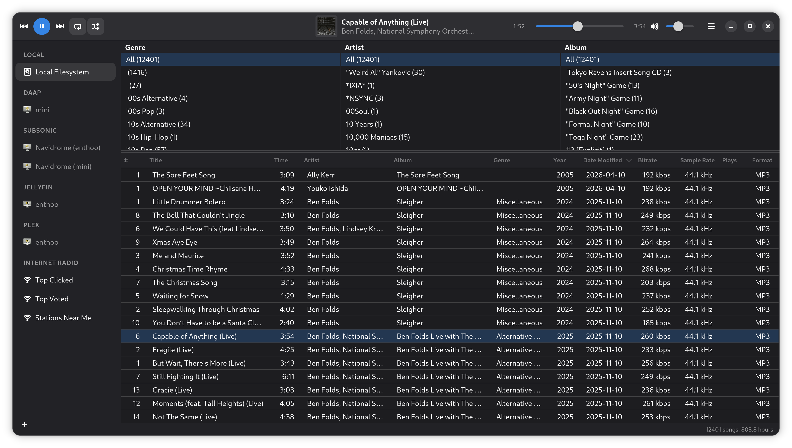

# Tributary

[](LICENSE)
[](https://github.com/jm2/tributary/actions)

A high-performance, **Rhythmbox-style** media manager written in pure Rust with **GTK4** and **libadwaita**.

Tributary provides a unified interface for managing and streaming music from multiple sources — local files, Subsonic/Navidrome, Jellyfin, Plex, DAAP/iTunes shares, and internet radio — all through a single, responsive library view.



## Features

| Feature | Status |
|---------|--------|
| GTK4 / libadwaita UI (Rhythmbox-style `GtkColumnView`) | ✅ |
| Browser filtering (Genre → Artist → Album) and folder browsing | ✅ |
| Local library with FS `date_modified` scanning | ✅ |
| Real-time filesystem watching (`notify`) | ✅ |
| SQLite persistence (`SeaORM`) | ✅ |
| GStreamer audio playback (`playbin3`) | ✅ |
| MPRIS / SMTC / macOS Now Playing integration (`souvlaki`) | ✅ |
| Playback controls (play/pause, next/prev, seek, volume) | ✅ |
| Shuffle & repeat (off / all / one) with persistence | ✅ |
| Column sort persistence | ✅ |
| Subsonic / Navidrome / Nextcloud Music backend | ✅ |
| Jellyfin backend | ✅ |
| Plex backend | ✅ |
| DAAP / iTunes Sharing backend (DMAP binary protocol) | ✅ |
| mDNS zero-config discovery (Subsonic, Plex, DAAP) | ✅ |
| Jellyfin UDP broadcast discovery | ✅ |
| DAAP sidebar eject button (disconnect) | ✅ |
| Password-only auth dialog (DAAP) | ✅ |
| Regular discovery refresh (add/remove servers dynamically) | ✅ |
| Manual server addition/deletion with `servers.json` persistence | ✅ |
| Internet Radio (Top Clicked, Top Voted, Stations Near Me) | ✅ |
| Tiered geo-location (geo-distance → state → country) | ✅ |
| Column drag-and-drop reordering with persistence | ✅ |
| Regular & smart playlists (iTunes-style rules engine) | ✅ Regular playlists may include remote tracks |
| Drag and drop tracks onto playlists | ✅ |
| Subsonic server playlists (import a copy, or keep a read-only synced mirror) | ✅ |
| Realtime text search filter (title, artist, album, genre) | ✅ |
| Song metadata editing (Properties dialog with Save/Cancel) | ✅ |
| Batch metadata editing (multi-select) | ✅ |
| MusicBrainz auto-fill lookup | ✅ |
| Keyboard shortcut: `Ctrl+F` / `Cmd+F` to search | ✅ |
| XDG music directory support (non-English locales) | ✅ |
| Network connection guard (prevents duplicate auth) | ✅ |
| i18n/l10n framework (13 languages, auto locale detection) | ✅ |
| Audio output selector (local + MPD + Chromecast) | ✅ |
| MPD output backend (sink-only, hardened TCP) | ✅ Requires exclusive-control confirmation |
| Output switching (click to swap local ↔ MPD) | ✅ |
| AirPlay 1 (RAOP) output | ⚠️ Discovered, but supported GStreamer builds lack the `raopsink` sender |
| AirPlay 2 / HomeKit output | ❌ Not yet supported — see [AirPlay roadmap](#airplay-roadmap) below |
| Chromecast output (Cast V2 — local files + remote sources) | ✅ |
| Album artist sort (preference toggle) | ✅ |
| Smart playlist compound sort (multi-key ordering) | ✅ |
| Geo-distance sorting for Stations Near Me | ✅ |
| USB/removable-media browsing (live sidebar entries + track scan) | ✅ |
| USB file transfer (copy to device with progress) | ❌ Planned ([#8](https://github.com/jm2/tributary/issues/8)) |
| Multiple music library directories | ✅ |
| Playlist import/export (XSPF) | ✅ |
| Rhythmbox profile migration | ✅ Preview-first import of ratings, play counts, and playlists |
| Local playback history (play counts and last-played times) | ✅ |
| Default smart playlists (Recently Added, Recently Played, Top 25) | ✅ |
| Track ratings | ✅ Editable for local tracks; remote ratings are shown read-only |
| Last.fm scrobbling | 🚧 Internal foundation only — not yet available to users |
| Window position persistence | ✅ |
| Windows 11 Snap Layout support | ✅ |
| Linux and macOS file associations | ✅ |
| Cross-platform: Linux, macOS, Windows | ✅ |
| Light & dark mode | ✅ Automatic (libadwaita) |

Last.fm scrobbling is being built behind the scenes and nothing is user-visible yet: no
settings, no sign-in, and no network activity. The
[Last.fm design](docs/lastfm-scrobbling.md) records what exists and what remains. The
[implementation roadmap](docs/roadmap.md) lists the audited open backlog and current limitations,
and [`docs/task.md`](docs/task.md) is the countable working list.

## Architecture

```text
┌──────────────────────────────────────────────────────────────┐
│ GTK4 / libadwaita UI and platform media controls            │
├──────────────────────────────────────────────────────────────┤
│ SourceRegistry: source identity, lifecycle, and              │
│ playback-time media resolution                               │
├──────────────────────────────────────────────────────────────┤
│ MediaBackend trait (async)                                   │
├────────┬──────────┬──────────┬──────┬──────┬────────┬────────┤
│ Local  │ Subsonic │ Jellyfin │ Plex │ DAAP │ Radio  │ Device │
├────────┴──────────┴──────────┴──────┴──────┴────────┴────────┤
│ AudioOutput: Local/GStreamer │ MPD │ AirPlay 1 │ Chromecast  │
└──────────────────────────────────────────────────────────────┘
```

The local library and the Subsonic, Jellyfin, Plex, and DAAP backends publish their catalogues
through one async `MediaBackend` trait, so the UI never knows or cares where the music comes
from. Radio-Browser views, removable mounts, and files opened from the OS plug in as lifecycle
adapters instead. `SourceRegistry` owns the lifecycle of every source and resolves media at
playback time: remote and removable rows and every playback queue carry only a stable `SourceId`
and `TrackId`, never a server address, credential, or mount path, while local rows keep a file
path for operations such as Properties. Outputs implement one `AudioOutput` trait. Last.fm is
absent from the diagram because it is not user-visible yet.

The [source identity and lifecycle decision](docs/architecture/source-lifecycle.md) documents the
registry seam in detail.

---

## Installation

### Fedora (COPR)

Tributary is available from the [jmsqrd/tributary](https://copr.fedorainfracloud.org/coprs/jmsqrd/tributary/) COPR repository:

```bash
sudo dnf copr enable jmsqrd/tributary
sudo dnf install tributary
```

### Arch Linux (AUR)

Tributary is available on the [AUR](https://aur.archlinux.org/) in three variants:

| Package | Description |
|---------|-------------|
| [`tributary`](https://aur.archlinux.org/packages/tributary) | Build from the latest release source |
| [`tributary-bin`](https://aur.archlinux.org/packages/tributary-bin) | Pre-built binary from the latest release |
| [`tributary-git`](https://aur.archlinux.org/packages/tributary-git) | Build from the latest `main` branch commit |

Install with your preferred AUR helper, for example:

```bash
yay -S tributary-bin
```

### Windows (winget)

Tributary is available via [winget](https://learn.microsoft.com/en-us/windows/package-manager/winget/):

```powershell
winget install jm2.Tributary
```

### Other Platforms

Pre-built packages for Linux (Flatpak, .deb, .rpm), macOS (.dmg), and Windows (.exe installer, .zip) are also available on the [Releases](https://github.com/jm2/tributary/releases) page.

> **macOS note:** The macOS `.dmg` is ad-hoc signed but not notarized, so macOS Gatekeeper will block it on first launch. After mounting the DMG and dragging Tributary to Applications, run:
> ```bash
> xattr -cr /Applications/Tributary.app
> ```
> Then open normally. This is only needed once.

---

## Building from Source

### Prerequisites (all platforms)

- [Rust 1.94+](https://rustup.rs) (stable toolchain) — the declared MSRV in `Cargo.toml`,
  verified by a dedicated CI job
- **GTK 4.16+** and **libadwaita 1.6+** — older runtimes fail to build, not merely fail at startup
- `pkg-config`

### Linux

> **Check your GTK version first:** `pkg-config --modversion gtk4`. Debian 12 and Ubuntu 24.04
> ship GTK 4.8/4.14 and libadwaita below 1.6, so the packages below are not sufficient on those
> releases — you will need a newer distribution, backports, or the Flatpak build.

**Debian / Ubuntu:**
```bash
sudo apt install libgtk-4-dev libadwaita-1-dev libgstreamer1.0-dev libdbus-1-dev pkg-config build-essential
```

**Fedora:**
```bash
sudo dnf install gtk4-devel libadwaita-devel gstreamer1-devel dbus-devel pkgconf-pkg-config gcc
```

**Arch Linux:**
```bash
sudo pacman -S gtk4 libadwaita gstreamer dbus pkgconf base-devel
```

Then build:
```bash
cargo build --release
# or use the helper script:
./scripts/build-linux.sh
```

The binary is at `target/release/tributary`.

### macOS

Requires [Homebrew](https://brew.sh):

```bash
brew install gtk4 libadwaita pkg-config gstreamer gst-plugins-good gst-plugins-bad gst-plugins-ugly gst-libav adwaita-icon-theme
cargo build --release
```

To create a `.app` bundle and `.dmg`:
```bash
brew install create-dmg   # optional, for DMG packaging
./scripts/build-macos.sh --dmg
```

The app bundle is at `dist/Tributary.app`, and the DMG at `dist/Tributary.dmg`.

> **Note:** The `.app` bundle includes rpath-fixed dylibs and is ad-hoc code-signed so it can run without Homebrew on the target machine. For distribution, proper Apple Developer code signing and notarization are recommended.

### Windows

Requires [MSYS2](https://www.msys2.org) with the CLANG64 environment:

```powershell
# In an MSYS2 CLANG64 shell:
pacman -S mingw-w64-clang-x86_64-gtk4 \
          mingw-w64-clang-x86_64-libadwaita \
          mingw-w64-clang-x86_64-gstreamer \
          mingw-w64-clang-x86_64-gst-plugins-good \
          mingw-w64-clang-x86_64-gst-plugins-bad \
          mingw-w64-clang-x86_64-gst-libav \
          mingw-w64-clang-x86_64-pkg-config \
          mingw-w64-clang-x86_64-toolchain
```

Then, in PowerShell:
```powershell
# Ensure Rust's LLVM target is installed:
rustup target add x86_64-pc-windows-gnullvm

# Build and bundle DLLs:
.\scripts\build-windows.ps1
```

This produces `dist/tributary-windows.zip` with the executable and all required DLLs/resources.
The bundle step probes the packaged GStreamer runtime and records a receipt tied to the exact
executable and WASAPI2 plugin; an installer-only `-InnoSetup -SkipBundle` run reuses the existing
tree only while that receipt still matches, so rerun the full bundle after changing either file.

### Release artifact component policy

Tributary does not play DVDs, Blu-ray discs, or DRM-protected media, and its packaging scripts
refuse to ship optical-disc decryption or content-decryption components. Ordinary audio codecs,
TLS, and general-purpose cryptography are unaffected. The
[release component policy](docs/release-component-policy.md) describes exactly what each
platform's packaging validates.

### Flatpak (Linux)

The manifest builds offline from a generated `build-aux/flatpak/cargo-sources.json`. The
repository vendors the pinned Cargo source generator (see
`build-aux/flatpak/flatpak-cargo-generator.PROVENANCE`), and the helper below verifies its
checksum before writing the manifest.

```bash
# Install the tools and configure Flathub for this user:
sudo apt install binutils flatpak flatpak-builder ostree python3-venv
flatpak remote-add --if-not-exists --user flathub \
  https://dl.flathub.org/repo/flathub.flatpakrepo

# Keep the generator dependencies isolated from the system Python:
FLATPAK_VENV="${XDG_CACHE_HOME:-$HOME/.cache}/tributary-flatpak-venv"
python3 -m venv "$FLATPAK_VENV"
source "$FLATPAK_VENV/bin/activate"
python3 -m pip install --requirement build-aux/flatpak/generator-requirements.txt

# Verify the vendored pin and generate the offline source manifest:
bash build-aux/flatpak/generate-cargo-sources.sh

# Build and install locally:
flatpak-builder --user --install-deps-from=flathub --force-clean --repo=repo --install \
  build-dir build-aux/flatpak/io.github.tributary.Tributary.yml
```

`./scripts/build-linux.sh --flatpak` runs the same steps without first requiring a native build.

The sandbox does not expose the whole home directory:

- **XDG Music** is available read/write.
- A custom library folder chosen in **Preferences → Library Folders** goes through the GTK
  [file-chooser portal](https://flatpak.github.io/xdg-desktop-portal/docs/doc-org.freedesktop.portal.FileChooser.html),
  which grants persistent read/write access. Tag editing still needs the folder to be writable on
  the host.
- Media mounted under `/media`, `/run/media`, and `/mnt` is exposed read-only for the automatic
  **Devices** entries and playback. To edit tags on external media, add the folder explicitly in
  Preferences instead.
- A custom path saved by an older Flatpak build may become unavailable under this policy. Use that
  root's **Reauthorize…** action in Preferences to reselect the same folder through the portal
  rather than removing and re-adding it, which would lose track IDs, history, and playlist links.

---

## Running

```bash
# From a release build:
./target/release/tributary

# With debug logging:
RUST_LOG=tributary=debug ./target/release/tributary

# With trace-level logging:
RUST_LOG=tributary=trace ./target/release/tributary
```


---

## Development

### Git Hooks

Tributary includes a pre-commit hook that runs `cargo fmt --check` to prevent formatting errors from being committed. To enable it after cloning:

```bash
git config core.hooksPath hooks
```

### Developer Build Scripts

All three platform build scripts support quick-exit modes for formatting, type-checking, and linting:

```bash
# Linux / macOS:
./scripts/build-linux.sh --fmt       # or build-macos.sh --fmt
./scripts/build-linux.sh --check     # or build-macos.sh --check
./scripts/build-linux.sh --clippy    # or build-macos.sh --clippy
```

```powershell
# Windows (PowerShell):
.\scripts\build-windows.ps1 -Fmt
.\scripts\build-windows.ps1 -Check
.\scripts\build-windows.ps1 -Clippy
.\scripts\build-windows.ps1 -Test
.\scripts\build-windows.ps1 -Run
```

Clippy runs with `clippy::pedantic` and `clippy::nursery` enabled crate-wide (configured in `src/main.rs`).

### Testing & Code Quality

```bash
# Run every host target and feature (unit, integration, and proptest suites):
cargo test --all-targets --all-features --locked

# Install the exact compiler, LLVM tools, and coverage frontend used by CI:
rustup toolchain install 1.94.0 --profile minimal --component llvm-tools-preview
cargo +1.94.0 install cargo-llvm-cov --version 0.8.7 --locked

# Run the Linux x86_64 coverage gate and print its summary:
minimum="$(tr -d '[:space:]' < coverage-baseline.txt)"
cargo +1.94.0 llvm-cov clean --workspace
cargo +1.94.0 llvm-cov --all-targets --all-features --locked --summary-only \
  --fail-under-lines "$minimum"

# Or generate the complete HTML report:
cargo +1.94.0 llvm-cov --all-targets --all-features --locked --html \
  --output-dir coverage --fail-under-lines "$minimum"
```

CI's coverage number comes from one Linux x86_64 run pinned to Rust 1.94.0 and cargo-llvm-cov
0.8.7 over every host target and feature; the other platforms' `--coverage` helpers are
informational only. [`coverage-baseline.txt`](coverage-baseline.txt) is the minimum accepted line
percentage. CI enforces the checked-in value but does not compare it with the base branch; the
repository review policy treats the floor as a ratchet: ordinary changes keep or raise it, while
lowering it requires a dedicated measurement-definition change that explains why. To raise it,
run the Linux command twice, take the lower total, round down to one decimal, and subtract 0.1
for instrumentation noise.

CI automatically runs on every push/PR:
- **Security audit** — `cargo audit` checks dependencies against the RustSec Advisory Database
- **Pedantic Clippy** — `clippy::pedantic` + `clippy::nursery` with `-D warnings`
- **Code coverage** — pinned `cargo-llvm-cov` Linux x86_64 line-floor gate, plus an HTML report
  uploaded as a CI artifact
- **Weekly fuzzing** — `cargo-fuzz` target for the DMAP binary parser (5 min, Sundays)

---

## Project Structure

```
src/
├── main.rs                 # Application entry point (GTK + tokio bootstrap)
├── lib.rs                  # Library surface for the tributary crate
├── platform_runtime.rs     # Early runtime setup for self-contained Windows/macOS builds
├── panic_reporting.rs      # Content-free panic diagnostics
├── discovery.rs            # mDNS + UDP zero-config server discovery
├── http_security.rs        # Shared hardening for outbound HTTP clients
├── http_body.rs            # Bounded response-body collection
├── remote_rating_wire.rs   # Tolerant decoding of optional remote ratings
├── source_lifecycle.rs     # Central source lifecycle ownership
├── source_registry.rs      # Lifecycle service for every managed media source
├── server_playlist_coordinator.rs # Latest-request coordination for server playlists
├── removable.rs            # Adapter for one mounted removable filesystem
├── external_file.rs        # Adapter for files opened from the OS
├── architecture/           # MediaBackend trait, core models, stable identity types, errors
├── audio/
│   ├── mod.rs              # GStreamer Player (playbin3, bus watch, position timer)
│   ├── output.rs           # AudioOutput trait
│   ├── local_output.rs     # Local GStreamer playback
│   ├── mpd_output.rs       # MPD TCP output
│   ├── airplay_output.rs   # AirPlay 1 (RAOP) output seam
│   ├── chromecast_output.rs# Chromecast/Cast V2 output (local + remote)
│   ├── cast_http_server.rs # Embedded LAN-only HTTP server for Chromecast
│   ├── gstreamer_media.rs  # Safe media preparation for GStreamer pipelines
│   ├── macos_audio.rs      # macOS default-output following
│   ├── windows_audio.rs    # Windows default-endpoint tracking
│   └── runtime_probe.rs    # Packaged-runtime playback probe
├── db/
│   ├── connection.rs       # SQLite init, XDG paths, migration runner
│   ├── entities/           # SeaORM entities (tracks, playlists, roots, links, receipts)
│   └── migration/          # Ordered, retry-safe SQLite schema migrations
├── desktop_integration/    # OS media controls via souvlaki (MPRIS/SMTC/Now Playing)
├── local/
│   ├── backend.rs          # MediaBackend impl (LocalBackend)
│   ├── engine.rs           # Async scan + notify FS watcher + LibraryEvent channel
│   ├── resolver.rs         # Playback-time resolution of local identities
│   ├── root_authority.rs   # Filesystem access beneath an exact library root
│   ├── tag_parser.rs       # lofty audio tag extraction
│   ├── tag_writer.rs       # lofty audio tag writing (MP3, M4A, OGG, FLAC)
│   ├── playlist_manager.rs # Regular + smart playlist CRUD
│   ├── playlist_io.rs      # XSPF playlist import/export
│   ├── playlist_sidebar.rs # Versioned playlist-sidebar projection
│   ├── playback_history.rs # Counted-play accounting
│   ├── smart_rules.rs      # iTunes-style smart playlist rules engine
│   ├── server_playlist_browser.rs # Headless browser for server playlists
│   ├── server_playlist_runtime.rs # Reconnect and manual pull for synced playlists
│   └── rhythmbox_*.rs      # Rhythmbox profile parsing and migration
├── subsonic/               # Subsonic REST API types, client, and MediaBackend impl
├── jellyfin/               # Jellyfin REST API types, client, and MediaBackend impl
├── plex/                   # Plex REST API types, client, and MediaBackend impl
├── daap/                   # DAAP client, DMAP binary parser, and MediaBackend impl
├── lastfm/                 # Last.fm client, credential vault, scrobble queue, and runtime
├── device/                 # Mounted removable-device discovery through GIO
├── radio/                  # Radio-Browser client, geolocation, and source adapter
└── ui/
    ├── window.rs           # Main window orchestration (GTK lifecycle + event wiring)
    ├── window_state.rs     # Shared WindowState struct
    ├── header_bar.rs       # Playback controls, now-playing, progress, volume
    ├── sidebar.rs          # Source list (local + remote + discovered + playlists)
    ├── browser.rs          # Search bar + Genre → Artist → Album filter panes
    ├── folder_browser.rs   # Folder pane over the local library
    ├── tracklist.rs        # GtkColumnView track listing
    ├── context_menu.rs     # Tracklist context menu, playlist add/remove, drag and drop
    ├── source_connect.rs   # Sidebar selection handler (source switching + auth flows)
    ├── source_navigation.rs# Asynchronous source navigation results
    ├── discovery_handler.rs# mDNS/DNS-SD event handler (sidebar + output list)
    ├── removable_media.rs  # Native mount monitoring
    ├── open_files.rs       # "Open With" / xdg-open delivery
    ├── playback.rs         # Playback context + track advance logic
    ├── playlist_actions.rs # Playlist CRUD (create, rename, delete, edit rules)
    ├── playlist_editor.rs  # Smart playlist rules editor dialog
    ├── playlist_projection.rs # Regular-playlist rows from stored entries
    ├── server_playlists.rs # Server playlist browser (Import Copy / Keep Synced)
    ├── server_playlist_recovery.rs # Status and recovery for synced playlists
    ├── properties_dialog.rs# Song properties editor (single + batch + MusicBrainz)
    ├── preferences.rs      # Preferences dialog (library folders, browser, columns)
    ├── rhythmbox_migration.rs # Rhythmbox import preview and apply
    ├── root_trust.rs       # Library-root trust prompts
    ├── library_commands.rs # Serialized history, rating, and root-trust commands
    ├── output_switch.rs    # Output selector click handler
    ├── output_dialogs.rs   # Add Output dialog + outputs.json persistence
    ├── server_dialogs.rs   # Add/auth server dialogs + servers.json persistence
    ├── album_art.rs        # Album art extraction (embedded tags + remote fetch)
    ├── persistence.rs      # Settings persistence (sort, shuffle, repeat, CSS)
    ├── radio.rs            # Radio-specific UI helpers
    ├── win32_snap.rs       # Windows 11 Snap Layout support
    ├── style.css           # Custom CSS overrides
    └── objects/            # GObject wrappers for tracks, sources, and browser items

scripts/
├── build-linux.sh          # Linux build + packaging helper
├── build-macos.sh          # macOS .app/.dmg builder (rpath fix + code sign)
└── build-windows.ps1       # Windows DLL bundler + Inno Setup

build-aux/
├── arch/PKGBUILD           # Arch Linux package definition
├── flatpak/                # Flatpak manifest and vendored source generator
├── inno/tributary.iss      # Windows Inno Setup installer script
├── linux/                  # Native package validation scripts
├── rpm/tributary.spec      # RPM spec
└── packaging/              # Forbidden bundled-component list

data/                        # .desktop, AppStream metainfo, icons
docs/                        # Design contracts, roadmap, and the active backlog
```

---

## Usage

### Browsing Your Library

On first launch, Tributary scans your XDG music directory (for example `~/Music`; configurable
in Preferences) and displays all discovered tracks in the main tracklist. Use the **browser
panes** above the tracklist to filter by Genre → Artist → Album, or browse the library by folder.
Click any column header to sort; click again to reverse; click a third time to clear the sort.

### Browsing Removable Media

Mounted USB drives and other removable media appear under a **Devices** heading in the sidebar
while they are attached. Tributary uses GIO's volume monitor, so it lists what the platform reports
as removable and follows mount, change, and unmount events live. Selecting a device shows its
scanned tracks; the scan stays on the device's own filesystem and does not follow links.

Tributary does not mount or eject volumes, and MTP-only devices are not supported. In the Flatpak,
automatic Devices entries are read-only and limited to `/media`, `/run/media`, and `/mnt` (see
[Flatpak (Linux)](#flatpak-linux)).

### Connecting to Remote Servers

Remote servers are discovered automatically via mDNS (DAAP, Subsonic, Plex) and UDP broadcast (Jellyfin). Discovered servers appear in the sidebar — click one to connect. Password-protected DAAP shares show a lock icon; passwordless shares connect with a single click.

To manually add a server, click the **+** button in the sidebar toolbar and enter the server type (Subsonic, Jellyfin, or Plex), URL, and credentials. Manually-added servers are persisted across launches (credentials are entered in the UI only — they are not stored on disk).

### Searching Your Library

Use the **search bar** above the browser panes to filter tracks in real-time. The search matches across title, artist, album, and genre simultaneously, and composes with any active browser pane selections. Clear the search by clicking the ✕ button or pressing Escape.

### Editing Song Metadata

Right-click any local track and select **Properties…** to view and edit its metadata. The Properties dialog supports:

- **Single-track editing** — Title, Artist, Album, Genre, Composer, Year, Track #, Disc # (plus
  read-only Format, Bitrate, Sample Rate, Duration, and File Path)
- **Batch editing** — Select multiple tracks, then right-click → Properties. Only batch-appropriate fields are shown (Artist, Album, Genre, Composer, Year, Disc #). Fields with mixed values display "Mixed" as a placeholder; only fields you explicitly change are written.
- **MusicBrainz Lookup** — In single-track mode, click "MusicBrainz Lookup" to search by title + artist. Results populate the form but are **not** saved automatically — you must click Save.

All edits require an explicit **Save** click. Cancel discards all changes. Before enabling
editing, Tributary checks that every selected file and its folder are writable; a read-only
device is explained up front. Saves are written to a temporary sibling file and atomically replace
the original, so a failed write leaves the track untouched. Supported formats: MP3 (ID3v2),
M4A/AAC, OGG Vorbis, and FLAC.

### Track Ratings

The Rating column shows a whole-number 1–100 value. Click a local track's rating to open the
editor, choose a value, and select **Apply**, or **Clear** to return it to Unrated. Ratings from
Subsonic, Jellyfin, and Plex are displayed read-only; DAAP and removable rows show Unavailable,
and radio stations have no Rating column. Sorting by Rating keeps rated rows first in either direction, and smart-playlist rules can
compare ratings (**is**, **is not**, **greater than**, **less than**, **in range**, **is rated**,
**is unrated**). See the [rating contract](docs/ratings.md) for the details.

### Playlists

Tributary supports regular and smart playlists:

- **Regular playlists** — Right-click the Playlists header in the sidebar to create one. Add tracks
  by right-clicking a selection, or by dragging it onto the playlist in the sidebar. Playlists can
  mix local tracks with tracks from connected Subsonic, Jellyfin, Plex, and DAAP servers; remote
  entries are stored by identity only, never by URL or credential. When a server is disconnected
  its entries stay in place as unavailable rows that you can keep or remove. Radio stations,
  removable media, and files opened from the OS cannot be added.
- **Smart playlists** — iTunes-style rules engine with filterable metadata fields,
  text/numeric/date operators, sorting, and result limiting. Smart playlists query the local
  library and are evaluated whenever they are opened or exported. Create them via the sidebar
  context menu.
- **Server playlists** — **Server Playlists…** on the Playlists header browses the playlists on a
  connected Subsonic server. **Import Copy** creates an ordinary editable playlist; **Keep Synced**
  creates a read-only mirror that follows the server. Selecting a mirror shows its status and the
  recovery actions that apply: **Sync Now**, **Retry**, **Replace Local with Server**, **Unlink**,
  and **Remove Local Copy**. Tributary never modifies playlists on the server. See the
  [Subsonic pull-sync contract](docs/subsonic-playlist-sync.md).

#### Importing and exporting playlists

Tributary reads and writes [XSPF version 1](https://www.xspf.org/spec) (`.xspf`) only. Right-click a
playlist to export it, or use **Import Playlist…** on the Playlists header.

On import, each track is matched against the local library by exact `file:` path first, then by
exact title + artist (and album when supplied); when several tracks match, the duration must
single one out within five seconds. Unmatched entries are kept in playlist order and become
playable if a matching track appears later. The whole import commits in one transaction and the
completion dialog reports matched, unmatched, and failed counts.

Export writes to a temporary file and atomically replaces the destination. XSPF only represents
local tracks, so exporting a playlist that contains remote entries is refused as a whole rather
than silently exporting a subset. Ratings are not part of the interchange in either direction.

Apple Music/iTunes XML, Google Takeout CSV, and M3U are not accepted directly. To convert an Apple
export, map each track's `Location`, `Name`, `Artist`, `Album`, and `Total Time` to the XSPF
`location`, `title`, `creator`, `album`, and `duration` elements (both use milliseconds). Takeout
data usually lacks local paths and verified artist tags, so fill those in before converting; a list
of video IDs or watch URLs is not enough to match a local library.

### Importing from Rhythmbox

Open **Preferences → Library** and choose **Import from Rhythmbox…**, then select the Rhythmbox
profile folder containing `rhythmdb.xml` (and `playlists.xml` when present). The preview shows
what will be imported before anything is written. Ratings and play counts are enabled by default;
last-played timestamps and overwriting an existing Tributary rating are explicit choices, and an
optional root remap handles a library that has moved.

Tracks are matched by exact file path only — never by title or a similar filename — and the
preview lists anything that cannot be represented. Static playlists keep their order and
duplicates; automatic playlists are imported only when their rules can be reproduced exactly. The
import is one atomic transaction, and repeating it with an unchanged profile and the same
choices is a no-op. See the [Rhythmbox migration contract](docs/rhythmbox-migration.md).

### Audio Outputs

The output selector in the header bar switches playback between the local GStreamer output,
MPD outputs, and discovered Chromecast devices. Use **Add Output** to add an MPD server.

MPD's pause, stop, repeat, random, single, and consume commands apply to the whole partition, so
Tributary only plays through an MPD output after you confirm that it has exclusive control of that
partition. Do not point another client or another Tributary instance at the same partition while
it is in use. Outputs saved by an older release have no confirmation and refuse to play until you
re-add the same host and port with the exclusive-control box checked; the existing entry is
upgraded in place.

The volume slider is shared across outputs that support application volume; MPD keeps its own
volume. Packaged Windows and macOS builds follow changes to the system default audio device.

### Playback Controls

- **Play/Pause** — click the circular play button, or double-click any track in the tracklist
- **Next / Previous** — skip buttons and OS media controls behave the same. More than three seconds
  into a track, Previous restarts it; otherwise it returns to the previously played track, and Next
  then retraces that history before moving on
- **Shuffle** — randomises the queue without immediately repeating the current track, and remembers
  recent history so Previous still works
- **Repeat** — cycles through Off → All → One
- **Seek** — drag the progress scrubber
- **Volume** — drag the volume slider (cubic perceptual curve)

A local track counts as played once half of it has been heard (capped at four minutes). Play
counts and last-played times feed the **Recently Played** and **Top 25 Most Played** smart
playlists, which refresh without restarting Tributary. Remote, radio, and removable tracks are not
counted. See the [playback-history contract](docs/playback-history.md).

### Keyboard Shortcuts

| Shortcut | Action |
|----------|--------|
| `Ctrl+F` / `Cmd+F` | Focus search bar |
| `Escape` | Clear the search |
| `Shift+F10` / `Menu` | Open the tracklist context menu |
| `Ctrl+Q` / `Cmd+Q` | Quit |

### Preferences

Open **Preferences** from the hamburger menu (☰) to:
- Change the local music library folders (supports multiple directories)
- Reauthorize a library folder or import from Rhythmbox
- Toggle browser filter panes (Genre, Artist, Album)
- Show/hide tracklist columns

---

## AirPlay roadmap

Legacy RAOP receivers are discovered today, but Tributary's AirPlay 1 path is only an integration
seam for a GStreamer element named `raopsink`. Current official GStreamer, Homebrew, and MSYS2
packages do not ship that element, so supported builds report AirPlay 1 as unavailable. AirPlay 2
receivers (HomePod, recent Apple TVs, and AirPlay-2-certified third-party speakers) advertise via
`_airplay._tcp.local.` and are also detected, but remain filtered out because AirPlay 2 needs a
different sender protocol stack. Both paths need a maintained sender implementation and
real-device validation.

Sender-side AirPlay 2 support requires, at minimum:

1. **A pairing/handshake step** to establish an authenticated session with the receiver before any audio is sent.
2. **An encrypted control channel** carrying the post-handshake messaging.
3. **An audio streaming path** delivering encoded audio in the format and timing the receiver expects.
4. **Multi-device clock sync** — only relevant if multi-room playback is in scope.

Each of these has specifics (key exchange algorithms, audio codec, RTSP/HTTP verbs, timing
format) that need to be confirmed against current AirPlay 2 reverse-engineering work before any
concrete dependency or implementation can be committed. This README intentionally does not
enumerate those details — they belong in a design doc once an implementation path is chosen.

Likely paths forward (each to be evaluated when the work begins):

- **Subprocess delegation** to a maintained external tool. Cheaper to integrate, but adds a runtime dependency outside the single-binary distribution model.
- **A pure-Rust sender implementation**, either in-tree or as a contributed `gst-plugins-rs` element. Higher engineering cost; cleanest distribution story.
- **Wait for an upstream component** to mature to the point that one of the above becomes obviously preferable.

The hook for whichever path is chosen is `service_type: "airplay2"` in [`src/discovery.rs`](src/discovery.rs); today that branch is dropped by [`src/ui/discovery_handler.rs`](src/ui/discovery_handler.rs), and that's where AirPlay 2 sender support will plug in.

---

## License

Tributary is licensed under the [GNU General Public License v3.0 or later](LICENSE).
